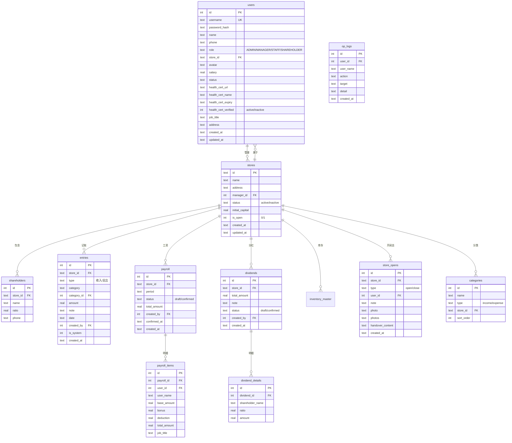

# 系统架构文档

## 系统概览

```
┌─────────────────────────────────────────────────────┐
│                    客户端                              │
│  ┌──────────────┐  ┌──────────────┐  ┌────────────┐  │
│  │ 桌面浏览器    │  │ 移动端PWA    │  │ 微信通知    │  │
│  └──────┬───────┘  └──────┬───────┘  └──────┬─────┘  │
│         │                  │                  │        │
├─────────┴──────────────────┴──────────────────┴────────┤
│                  Nginx 反向代理                         │
├────────────────────────────────────────────────────────┤
│              Express Server (:3001)                     │
│  ┌─────────┐ ┌──────────┐ ┌──────────┐ ┌───────────┐  │
│  │ 认证JWT  │ │ 路由处理  │ │ 文件上传  │ │ 静态服务   │  │
│  └─────────┘ └──────────┘ └──────────┘ └───────────┘  │
├────────────────────────────────────────────────────────┤
│              SQLite (WAL模式)                           │
│  store.db + store.db-wal + store.db-shm               │
└────────────────────────────────────────────────────────┘
```

## 技术栈

| 层级 | 技术 | 版本 |
|------|------|------|
| 运行时 | Node.js | 20+ |
| 后端框架 | Express | 4.x |
| TypeScript运行时 | tsx | 最新 |
| 前端框架 | React | 18.x |
| 构建工具 | Vite | 8.x |
| 数据库 | SQLite (better-sqlite3) | - |
| 认证 | JWT (jsonwebtoken) | - |
| 密码加密 | bcryptjs | - |
| UI图标 | lucide-react | - |
| CSS | Tailwind CSS | - |
| OCR | Tesseract.js | 7.x |

## 目录结构

```
apps/server/src/
├── index.ts           # [核心] Express入口，路由挂载
├── auth.ts            # [核心] JWT认证中间件
├── db.ts              # [核心] 数据库初始化、表结构、迁移、种子
├── oplog.ts           # [核心] 操作日志记录
├── notify.ts          # 消息推送
├── report-image.ts    # 经营报告图片生成
├── seed.ts            # 测试数据种子
└── routes/
    ├── auth.ts        # 登录/用户信息/密码
    ├── stores.ts      # 门店CRUD
    ├── entries.ts     # 记账CRUD
    ├── payroll.ts     # 工资管理
    ├── dividends.ts   # 分红管理
    ├── inventory.ts   # 盘点管理
    ├── shifts.ts      # 开闭店
    ├── dashboard.ts   # 管理大屏聚合
    ├── report.ts      # 单店报表
    ├── reports.ts     # 汇总报表
    ├── system.ts      # 备份/恢复/升级/通知
    ├── logs.ts        # 操作日志查询
    ├── categories.ts  # 收支分类
    ├── users.ts       # 用户管理
    ├── handovers.ts   # 交接记录
    ├── health-cert.ts    # 健康证上传/OCR/保存
    ├── health-check.ts    # 健康证到期检查
    └── notifications.ts # 通知管理

apps/web/src/
├── main.tsx           # React入口
├── App.tsx            # [核心] 路由配置
├── index.css          # 全局样式
├── components/        # 通用组件
│   ├── GlassCard.tsx      # 毛玻璃卡片
│   ├── Modal.tsx          # 弹窗
│   ├── PageHeader.tsx     # 页面标题
│   ├── PeriodTabs.tsx     # 日/周/月/年/总 切换
│   ├── FloatingActionButton.tsx # 移动端浮动按钮
│   └── StoreGuard.tsx     # 门店权限守卫
├── layouts/
│   ├── AppShell.tsx       # [核心] 整体布局
│   ├── Sidebar.tsx        # 桌面端侧边栏
│   ├── BottomNav.tsx      # 移动端底部导航
│   └── TopBar.tsx         # 顶部栏
├── lib/
│   ├── api.ts             # [核心] API请求封装
│   ├── format.tsx         # 金额格式化、万元切换
│   └── permissions.ts     # [核心] 权限判断
├── stores/
│   └── data.ts            # [核心] 全局状态管理
├── pages/
│   ├── login/             # 登录页
│   ├── dashboard/         # 管理大屏
│   ├── stores/            # 门店管理
│   ├── store/             # 店铺各功能页面
│   ├── settings/          # 系统设置
│   ├── logs/              # 全局日志
│   └── notifications/     # 通知中心
```

## 数据库 ER 图



## 认证流程

```
客户端                    服务器                    JWT
  │ POST /auth/login        │                        │
  │ {username, password}    │                        │
  │ ──────────────────────> │                        │
  │                         │ 查库验证密码             │
  │                         │ ──────────────────────> │
  │                         │ <────────────────────── │
  │ <── {token, user}       │                        │
  │                         │                        │
  │ 后续请求 Authorization: Bearer <token>            │
  │ ──────────────────────> │                        │
  │                         │ jwt.verify(token)       │
  │                         │ req.user = decoded      │
  │ <── 正常响应              │                        │
```

Token有效期7天，payload包含：`{id, username, name, role, store_id}`

## 核心函数说明

### opLog (oplog.ts)
```typescript
function opLog(userId: number, storeId: number | string, action: string, detail: string)
```
- 记录操作日志到 `op_logs` 表
- 记账修改日志使用JSON格式：`{action:'modify', before:{...}, after:{...}}`
- 其他操作直接存储文本

### normalizeType (entries.ts)
```typescript
function normalizeType(type: string): string
// income → 收入
// expense → 支出
```
数据库中统一存储中文类型，前端传入英文自动转换。

## 关键技术决策

### 1. 记账类型归一化
数据库中 `entries.type` 统一存储为 `'收入'` 或 `'支出'`，前端传入 `'income'/'expense'` 自动转换。

### 2. 操作日志格式
- 普通操作：文本字符串，如 `'新增收入 餐饮 ¥500'`
- 修改操作：JSON格式，包含before/after对比

### 3. 数据备份
SQLite WAL模式下，备份需要：
1. `PRAGMA wal_checkpoint(FULL)` 将WAL写回主库
2. 打包 `store.db` + `store.db-wal` + `store.db-shm`

### 4. 服务器重启
不能使用 `process.exit(0)` 因为会杀死所有子进程。使用独立进程重启：
- Windows: `start /b cmd /c "cd /d {dir} && node --import tsx src/index.ts"`
- Linux: `nohup node --import tsx src/index.ts &`

### 5. ZIP升级
1. 用户上传ZIP包到服务器临时目录
2. 解压到临时目录
3. 读取 `upgrade.json` 验证版本信息
4. 用新文件覆盖现有文件
5. 启动独立进程重启服务器
6. 当前进程退出

## 模块职责边界

### 核心文件（修改需谨慎）
- `apps/server/src/db.ts` - 数据库结构，迁移脚本
- `apps/server/src/auth.ts` - 认证逻辑
- `apps/web/src/App.tsx` - 路由配置
- `apps/web/src/lib/permissions.ts` - 权限控制
- `apps/web/src/stores/data.ts` - 全局状态

### 可安全修改
- `apps/web/src/pages/` - 页面组件
- `apps/web/src/components/` - 通用组件
- `apps/server/src/routes/` - API路由
- `apps/web/src/index.css` - 样式

## 已知技术债

1. **数据库ID类型** - `stores.id` 是TEXT类型，其他表是INTEGER，需要兼容处理
2. **编码历史** - 早期文件有编码损坏，已修复但可能存在残留
3. **前端构建** - 单文件超过500KB，可考虑代码分割
4. **TypeScript** - 部分类型使用 `any`，可逐步加强类型定义